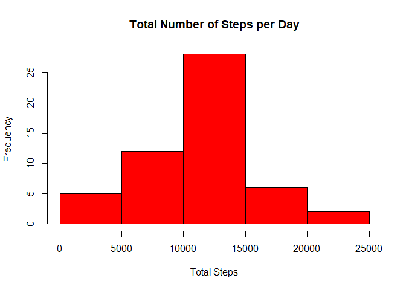

## Loading and preprocessing the data


```r
activityData <- read.csv("activity.csv", stringsAsFactors = FALSE)
dim(activityData)
```

```
## [1] 17568     3
```

```r
filteredactivityData <- activityData[complete.cases(activityData), ]
dim(filteredactivityData)
```

```
## [1] 15264     3
```

## What is mean total number of steps taken per day?


```r
stepsPerDay <- aggregate(steps ~ date, filteredactivityData, sum)

library(ggplot2)

hist(stepsPerDay$steps,col = "red",xlab = "Total Steps",ylab = "Frequency",main = "Total Number of Steps per Day")
```

<!-- -->

```r
print(meanStepsPerDay <- mean(stepsPerDay$steps))
```

```
## [1] 10766.19
```

```r
print(medianStepsPerDay <- median(stepsPerDay$steps))
```

```
## [1] 10765
```


## What is the average daily activity pattern?


```r
stepsforInterval<-aggregate(steps~interval, data=filteredactivityData, mean)
plot(steps~interval, data=stepsforInterval, type="l",xlab = "Interval" , ylab = "Steps")
```

<!-- -->


```r
print(fiveminintervalwithMaxSteps <- stepsforInterval[which.max(stepsforInterval$steps),]$interval)
```

```
## [1] 835
```

## Imputing missing values


```r
totalNAvalues <- sum(is.na(activityData$steps))
print(totalNAvalues)
```

```
## [1] 2304
```


```r
getMeanStepsPerInterval<-function(interval){
    stepsforInterval[stepsforInterval$interval==interval,]$steps
}


activityDataNoMissingvalues<-activityData
for(eachvalue in 1:nrow(activityDataNoMissingvalues)){
    if(is.na(activityDataNoMissingvalues[eachvalue,]$steps)){
        activityDataNoMissingvalues[eachvalue,]$steps <- getMeanStepsPerInterval(activityDataNoMissingvalues[eachvalue,]$interval)
    }
}

filteredactivityDataCheck <- activityDataNoMissingvalues[complete.cases(activityDataNoMissingvalues), ]
dim(filteredactivityDataCheck)
```

```
## [1] 17568     3
```

```r
#The check above illustrates that all NA values are filled in

#Histogram with the above new data set

stepsPerDaynew <- aggregate(steps ~ date, activityDataNoMissingvalues, sum)
hist(stepsPerDay$steps,col = "red",xlab = "Total Steps",ylab = "Frequency",main = "Total Number of Steps per Day")
```

<!-- -->

```r
print(meanStepsPerDaynew <- mean(stepsPerDaynew$steps))
```

```
## [1] 10766.19
```

```r
print(medianStepsPerDaynew <- median(stepsPerDaynew$steps))
```

```
## [1] 10766.19
```

```r
#The mean did not change however the median changed by a small %
```

## Are there differences in activity patterns between weekdays and weekends?


```r
activityDataNoMissingvalues$date <- as.Date(strptime(activityDataNoMissingvalues$date, format="%Y-%m-%d"))
activityDataNoMissingvalues$day <- weekdays(activityDataNoMissingvalues$date)
for (eachday in 1:nrow(activityDataNoMissingvalues)) {
    if (activityDataNoMissingvalues[eachday,]$day %in% c("Saturday","Sunday")) {
        activityDataNoMissingvalues[eachday,]$day<-"Weekend"
    }
    else{
        activityDataNoMissingvalues[eachday,]$day<-"Weekday"
    }
}
stepsEachDay <- aggregate(activityDataNoMissingvalues$steps ~ activityDataNoMissingvalues$interval + activityDataNoMissingvalues$day, activityDataNoMissingvalues, mean)


names(stepsEachDay) <- c("interval", "day", "steps")
library(lattice)
xyplot(steps ~ interval | day, stepsEachDay, type = "l", layout = c(1, 2), 
        xlab = "Interval", ylab = "Number of steps")
```

<!-- -->
